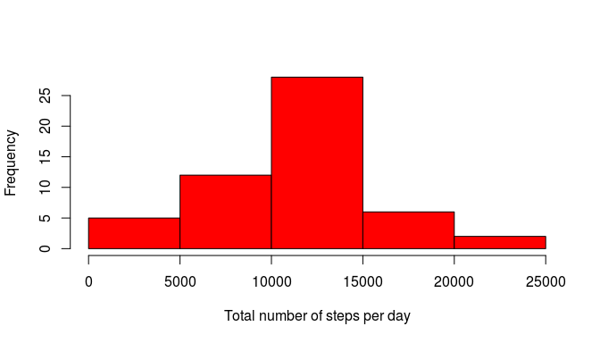

# Reproducible Research: Peer Assessment 1


## Loading and preprocessing the data

Unzip the input zip file to the current directory, read the csv file and convert dates to the R date format:

```r
unzip("activity.zip",exdir="./")
activity<-read.csv("activity.csv",stringsAsFactor=FALSE)
activity$date<-as.Date(activity$date,format="%Y-%m-%d")
```


## What is mean total number of steps taken per day?

Group data frame by dates and calculate sum of steps taken on given day:

```r
library(dplyr) # to help manipulate dataset
```

```
## 
## Attaching package: 'dplyr'
## 
## The following object is masked from 'package:stats':
## 
##     filter
## 
## The following objects are masked from 'package:base':
## 
##     intersect, setdiff, setequal, union
```

```r
activity_by_date<-group_by(activity,date)
total_steps<-summarise(activity_by_date,sum(steps))
```

Make a numeric vector of total number of steps taken every day:

```r
steps_per_day<-total_steps[[2]]
```

Create a histogram with distribution of the total number of steps per day and save it to the file:

```r
hist(steps_per_day,xlab="Total number of steps per day",main="",col = "red")
```

 

Now calculate the mean and median:

```r
mean(steps_per_day[!is.na(steps_per_day)])
```

```
## [1] 10766.19
```

```r
median(steps_per_day[!is.na(steps_per_day)])
```

```
## [1] 10765
```


## What is the average daily activity pattern?


## Imputing missing values


## Are there differences in activity patterns between weekdays and weekends?
